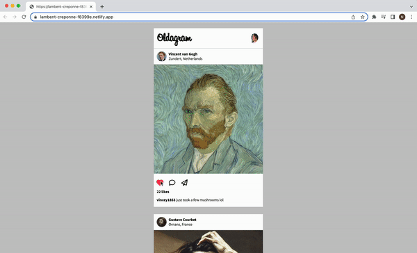

# Oldagram

Instagram clone.

## Features
Users can scroll and like the posts by pressing the heart button or double-clicking the image. They can also unlike the post if they wish.

## Demo

Test it on Netlify: https://lambent-creponne-f8399e.netlify.app/

## Technologies
The project is built using:
* HTML
* CSS
* JavaScript

## Technical details
* Rendered all the posts using the data file in Javascript.
* Connected each like button to its post.
* Added double-click to like the post.
* There is an option to unlike the post.
* Followed the design file on Figma.

## Room for improvement
* Render a big white heart over the image when the user double clicks the image to like it.

## Project status
The project is complete.

## Acknowledgements
Oldagram is a solo project that was part of [the Frontend Developer Career Path at Scrimba](https://scrimba.com/learn/frontend).

## Contact
Created by [Natalia Davtyan](https://github.com/nataliadavtyan)
